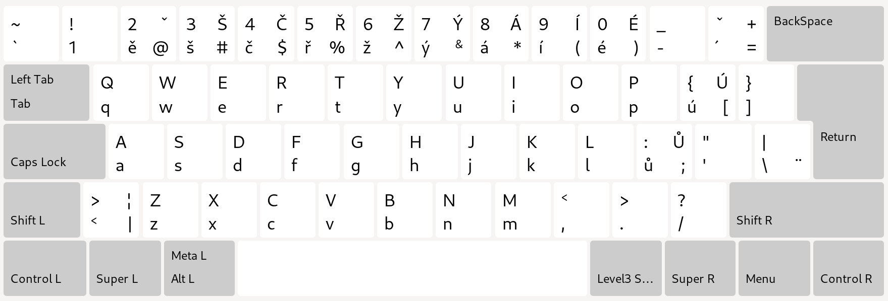

# Czech (czenglish) Keyboard Layout

Rozložení české klávesnice pro zachování maximální podoby US amerického rozložení. V kombinaci s US anglickou klávesnicí se při přepínání těchto dvou rozložení minimalizuje potřeba myslet na změny v klasickém českém rozložení, a zůstávají přístupné formátovací znaky pro Markdown pouze z levé ruky, atd.



## Instalace

### Linux (X11/XKB)

Konfigurace probíhá v:

```bash
sudo vim /usr/share/X11/xkb/symbols/cz
sudo vim /usr/share/X11/xkb/rules/evdev.xml
```

Zkopírujte obsah souboru `czenglish_layout` do `/usr/share/X11/xkb/symbols/cz` a přidejte variantu z `evdev.xml` do `/usr/share/X11/xkb/rules/evdev.xml`.

### Windows

Pro Windows použijte jeden z následujících způsobů:

1. **Microsoft Keyboard Layout Creator (doporučeno)**
   - Stáhněte [MSKLC](https://www.microsoft.com/en-us/download/details.aspx?id=102134)
   - Načtěte soubor `czenglish.klc`
   - Zkompilujte a nainstalujte
   
2. **Automatická instalace**
   ```cmd
   Install-Windows.bat
   ```
   nebo
   ```powershell
   .\Install-CzEnglishLayout.ps1
   ```

**Podrobný návod pro Windows:** Viz [WINDOWS_INSTALL.md](WINDOWS_INSTALL.md)

## Soubory

- `czenglish_layout` - XKB layout definice pro Linux
- `evdev.xml` - Fragment pro registraci v XKB
- `czenglish.klc` - Microsoft Keyboard Layout Creator soubor pro Windows
- `Install-CzEnglishLayout.ps1` - PowerShell instalační skript pro Windows
- `Install-Windows.bat` - Batch instalační skript pro Windows
- `WINDOWS_INSTALL.md` - Detailní návod pro instalaci na Windows

## Licence

© 2025 Tomas Mark (tomas@digitalspace.name)

