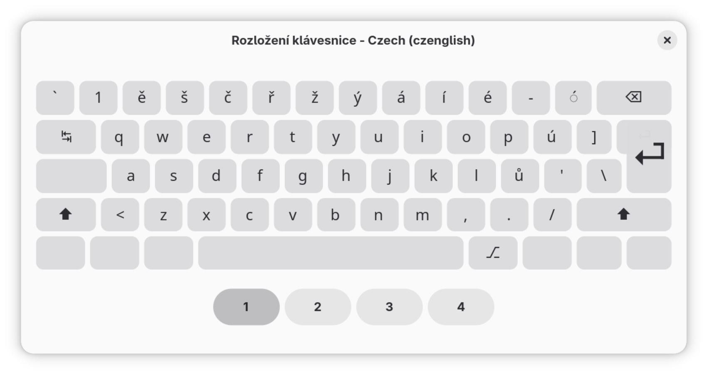
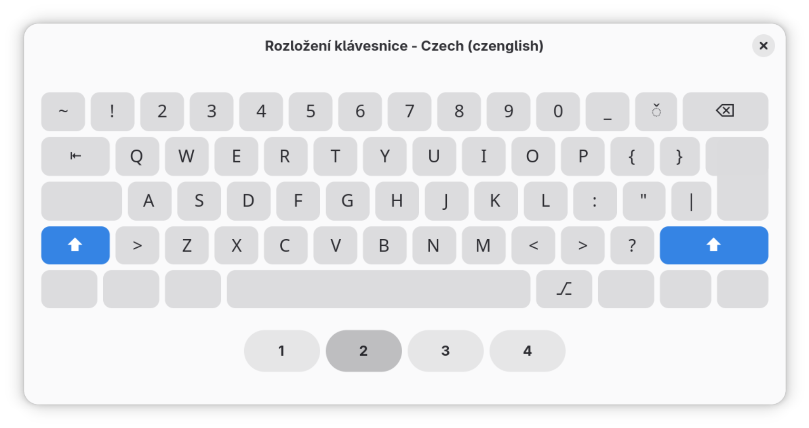
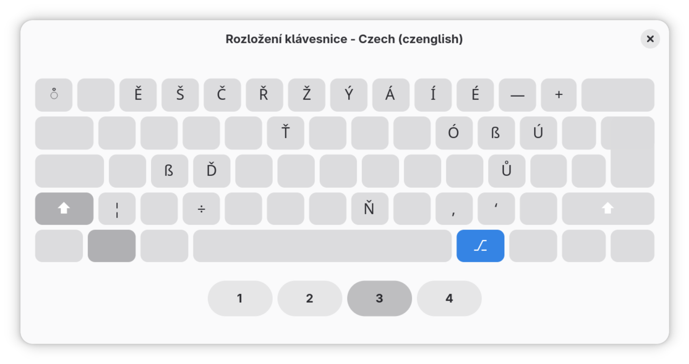
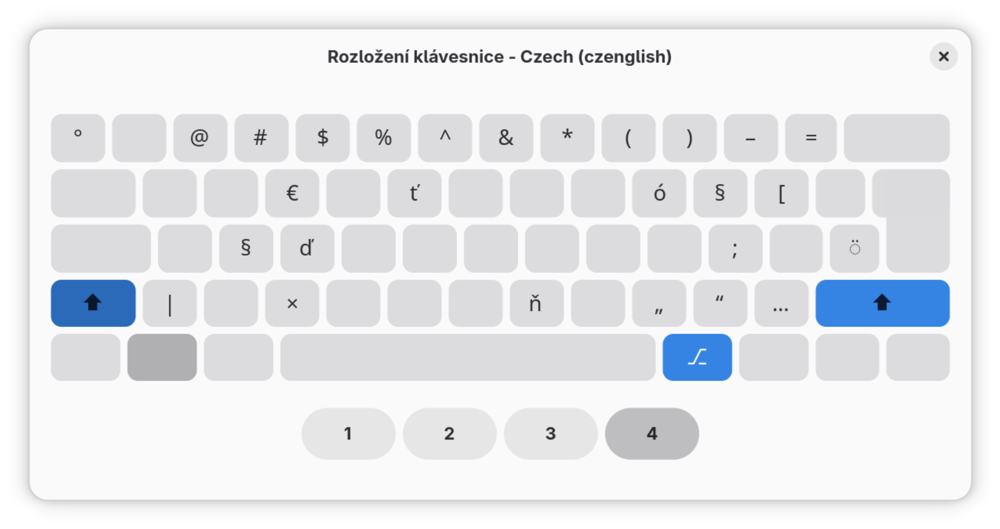

# Czenglish Keyboard Layout

České rozložení klávesnice pro zachování maximální kompatibility s anglickým rozložením.

> layout se ještě stále upravuje






# Instalace

### Linux (XKB) - aktuální k 2025/11/29

Použijte script pro automatickou instalaci:

```bash
git clone https://github.com/tomasmark79/czenglish.git
cd czenglish
./Install-Linux.sh
```   

Nebo manuální instalace:

1. **Zkopírujte soubory** `czenglish_layout` a `evdev.xml` do `/usr/share/X11/xkb/symbols/` a `/usr/share/X11/xkb/rules/` (vyžaduje root oprávnění)
2. **Restartujte X server** nebo se odhlaste a přihlaste znovu
3. **Vyberte nový layout** v nastavení klávesnice vašeho desktopového prostředí (např. GNOME, KDE, XFCE).

### Windows

#### Varianta A: Stažení připraveného instalátoru (doporučeno)

zastaralé, potřebuje aktualizaci - v plánu

1. **Stáhněte instalátor** z [GitHub Releases](https://github.com/tomasmark79/czenglish/releases)
2. **Rozbalte ZIP** a spusťte `setup.exe` jako administrátor
3. **Restartujte** počítač nebo se odhlaste a přihlaste
4. **Aktivujte layout**:
   - Settings → Time & Language → Language & region
   - Czech → Options → Add a keyboard → Czech CZ-EN
5. **Přepínejte** layouty pomocí Windows + Space

#### Varianta B: Kompilace ze zdrojového souboru

1. **Stáhněte Microsoft Keyboard Layout Creator (MSKLC)**
   - [MSKLC Download](https://www.microsoft.com/en-us/download/details.aspx?id=102134)
2. **Zkompilujte layout**
   - Otevřete MSKLC
   - Načtěte soubor `czenglish.klc` (File → Load Source File)
   - Zkompilujte: Project → Build DLL and Setup Package
3. **Nainstalujte** vygenerovaný `setup.exe` jako administrátor
