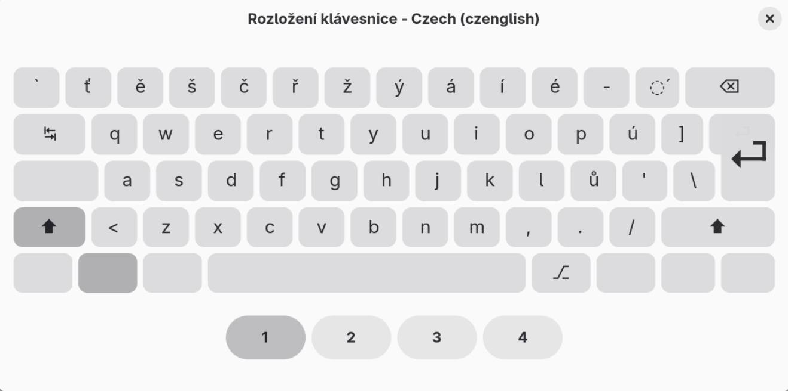
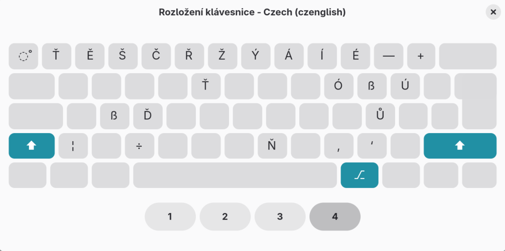
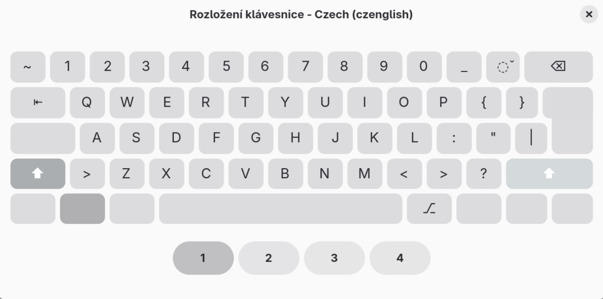
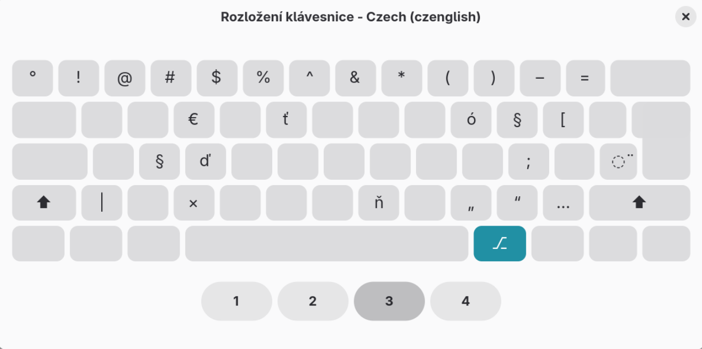

# Czenglish Keyboard Layout

Speciální české rozložení klávesnice pro zachování maximální kompatibility s anglickým rozložením. 

> Výjimečnost tohoto rozložení spočívá v tom, že **apostrof**, **vlnka**, **lomítko**, **zpětné lomítko**, **otazník** a **mnoho dalších znaků** zůstává na svém původním anglickém rozložení, což je velmi praktické v případě, že jste vývojář.

> Prakticky se již jedná o finální verzi rozložení a dlouhodobě rozložení používám






# Instalace

### Linux (XKB)

Instalátor vyžaduje Bash a Python 3.8 nebo novější (balíček `python3`).
Na běžném Linuxu použijte:

```bash
git clone https://github.com/tomasmark79/czenglish.git
cd czenglish
sudo ./install-linux.sh
```

Skript nainstaluje rozložení a automaticky nastaví podporu IBus, pokud je
nainstalovaný. Původní systémové soubory zálohuje vedle originálů
(`*.backup.DATUM_ČAS`). Instalátor lze spustit opakovaně.

Po instalaci se odhlaste a znovu přihlaste. V nastavení klávesnice vyberte
**Czech (czenglish)**.

IBus Simple se hledá v `/usr/share/ibus/component/simple.xml` a
`/usr/local/share/ibus/component/simple.xml`. Pro jinou instalaci lze cestu zadat:

```bash
sudo ./install-linux.sh --ibus-component /opt/ibus/share/ibus/component/simple.xml
```

Aktualizace systémových balíčků XKB nebo IBus mohou změny přepsat; v takovém
případě spusťte instalátor znovu.

### NixOS

Do konfigurace NixOS přidejte následující nastavení. Linuxový instalátor zde
nespouštějte.

```nix
# Czenglish keyboard layout
  services.xserver.xkb = {
    extraLayouts.cze = {
      description = "Czenglish";
      languages = [ "ces" ]; # ISO 639-2 kód češtiny
      symbolsFile =
        pkgs.fetchFromGitHub {
          owner = "tomasmark79";
          repo = "czenglish";
          rev = "5a405e5f96103e997a9f5f64e0403eb5a1e8f6c0";
          hash = "sha256-i0NDINIy8kOHT+QRC+lZ8VzOJT2rguqCNr8dbCvCFkc=";
        }
        + "/czenglish_layout";
    };
    layout = "us";
    variant = "";
    options = "eurosign:e,caps:escape";
  };
```

Pokud používáte GNOME s IBus, přidejte do stejné konfigurace také následující
nastavení registrace rozložení (ověřeno s IBus 1.5.33):

```nix
nixpkgs.overlays = [
  (_final: prev: {
    ibus-with-plugins = prev.ibus-with-plugins.overrideAttrs (old: {
      pathsToLink = old.pathsToLink ++ [ "/share/ibus/component" ];
      postBuild = (old.postBuild or "") + ''
        simpleXml="$out/share/ibus/component/simple.xml"
        cp --remove-destination ${prev.ibus}/share/ibus/component/simple.xml "$simpleXml"
        chmod u+w "$simpleXml"
        substituteInPlace "$simpleXml" --replace-fail '</engines>' '<engine>
          <name>xkb:cze::ces</name>
          <language>cs</language>
          <layout>cze</layout>
          <longname>Czenglish</longname>
          <description>Czenglish</description>
          <icon>ibus-keyboard</icon>
          <rank>50</rank>
        </engine></engines>'
      '';
    });
  })
];
```

Použijte svůj běžný příkaz pro rebuild NixOS, například:

```bash
sudo nixos-rebuild switch
```

Potom se odhlaste a znovu přihlaste. V nastavení klávesnice přidejte **Czenglish**.

### Manuální instalace XKB na běžném Linuxu

1. Zálohujte systémové soubory `symbols/cz` a `rules/evdev.xml` v `/usr/share/X11/xkb/`.
2. Připojte obsah `czenglish_layout` do `symbols/cz` jako variantu `czenglish`.
3. Vložte fragment z projektového `evdev.xml` do `<variantList>` českého rozložení `<name>cz</name>` v systémovém `rules/evdev.xml`. Projektový soubor je pouze fragment — nenahrazujte jím celý systémový soubor.
4. Odhlaste se a přihlaste znovu a vyberte `Czech (czenglish)` v nastavení klávesnice.

Tím se nainstaluje pouze část XKB. Pro registraci IBus použijte instalátor
výše. Systémové aktualizace mohou ruční změny přepsat.

### Windows

#### Varianta A: Stažení připraveného instalátoru (doporučeno)

1. **Stáhněte instalátor** z [GitHub Releases](https://github.com/tomasmark79/czenglish/releases)
2. **Rozbalte ZIP** a spusťte `setup.exe` jako administrátor
3. **Restartujte** počítač nebo se odhlaste a přihlaste
4. **Aktivujte layout**:
   - Settings → Time & Language → Language & region
   - Czech → Options → Add a keyboard → Czech CZ-EN
5. **Přepínejte** layouty pomocí Windows + Space

#### Varianta B: Kompilace ze zdrojového souboru

1. **Stáhněte Microsoft Keyboard Layout Creator (MSKLC)**
   - [MSKLC Download](https://www.microsoft.com/en-us/download/details.aspx?id=102134)
2. **Zkompilujte layout**
   - Otevřete MSKLC
   - Načtěte soubor `czenglish.klc` (File → Load Source File)
   - Zkompilujte: Project → Build DLL and Setup Package
3. **Nainstalujte** vygenerovaný `setup.exe` jako administrátor
4. **Odebrání klávesnice** - odinstalace instalatorem
5. **Odebrání klávesnice** - když selže odinstalace instalátorem  
   a. smazat klíč z registru   HKEY_LOCAL_MACHINE\SYSTEM\CurrentControlSet\Control\Keyboard   Layouts\a0000405  
   b. restart Windows  
   c. smazat ve Windows/system32 a Windows/systemWow64 soubor Czenglis.dll  


### Testy linuxového instalátoru

```bash
python3 -m unittest discover -s tests -v
```

Testy používají dočasný adresář a nepotřebují root. Volba instalátoru
`--root /cesta/k/pripravenemu/systemu` je určená pro testování a balení;
cesty včetně `--ibus-component` se pak vztahují k tomuto kořeni.
