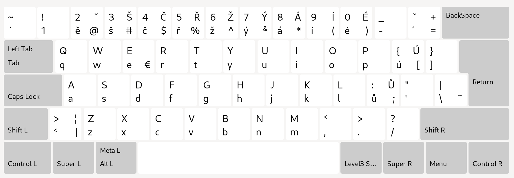

Rozložení české klávesnice pro zachování maximální podoby amerického rozložení, které mě osobně přijde prakticky dokonalé. V kombinaci s US anglickou klávesnicí se při přepínání těchto dvou rozložení minimalizuje potřeba myslet na změny v klasickém českém rozložení, které např. rozbíjejí nastavené klávesové zkratky, apod.



### KOnfigurace probíhá v

```bash
sudo vim /usr/share/X11/xkb/symbols/cz
sudo vim /usr/share/X11/xkb/rules/evdev.xml
```